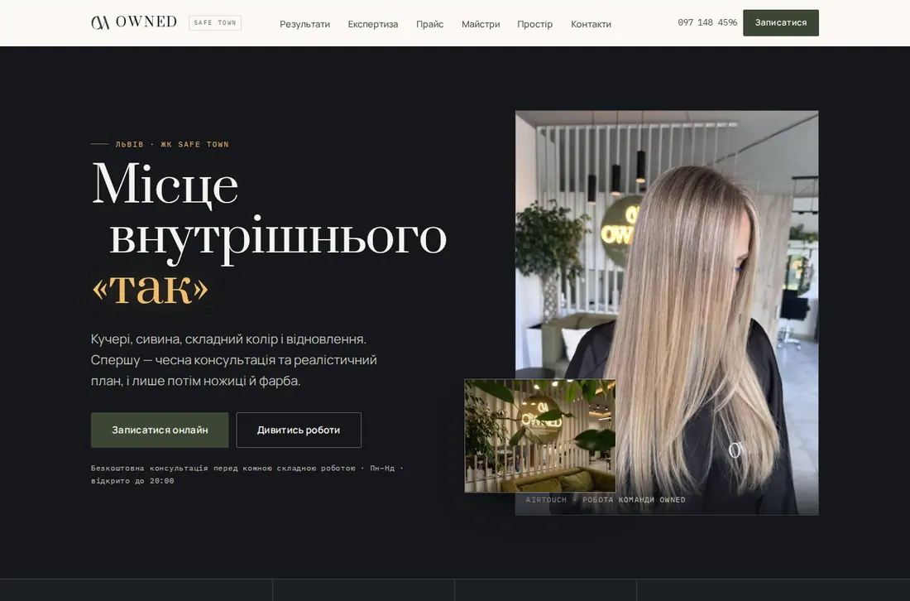

# OWNED — сайт салону краси (v4)

Статичний сайт бʼюті-простору OWNED (Львів, ЖК Safe Town). Без збірки на
рантаймі: `site/index.html` згенеровано й закомічено, сервер лише роздає файли.



## Локально

```bash
npm start          # http://localhost:3000  — v4
                   # http://localhost:3000/v3/ — попередній прототип
```

## Редагування контенту

Увесь текст, прайс, майстри, кейси та відгуки лежать в одному файлі:

```bash
$EDITOR site/data/site.json
npm run build      # перезбирає site/index.html
```

`site/index.html` — згенерований файл, редагувати вручну не потрібно.

## Оновлення відео

```bash
FFMPEG=/path/to/ffmpeg node scripts/build-video.mjs /path/to/masters
```

Готові файли закомічені — ні збірка, ні деплой ffmpeg не потребують.

## Оновлення шрифтів

```bash
node scripts/fetch-fonts.mjs   # оновлює site/fonts + site/css/fonts.css
```

Шрифти self-hosted (Prata · Manrope · IBM Plex Mono, кириличні та латинські
підмножини) — сторінка не робить жодного стороннього запиту.

## Що це

Редизайн живого сайту: нова інформаційна архітектура, повне порівняння
до / після, відкритий прайс, реальна сітка майстрів і три явні шляхи запису.

Два коротких відео салону — у героєвій вставці та в картці «Простір і вивіска».
Обидва завантажуються лише після критичного рендеру й лише коли потрапляють у
кадр; постер — це готове зображення, а не заглушка. При `prefers-reduced-motion`
або economy-режимі відео не вантажиться взагалі.

Локальні заміри: перший екран — 522 КБ на мобільному (0 КБ відео), 756 КБ без
відео на десктопі; 14 КБ JS; 0 порушень axe-core на 1440 та 390 px.

Деталі аудиту, рішень і вимірювань — `docs/04_REDESIGN_V4.md`.
Дизайн-система — `docs/03_DESIGN_SYSTEM.md`.

## Деплой

Railway · Dockerfile · `node scripts/serve.mjs` (порт із `PORT`, типово 8080).
